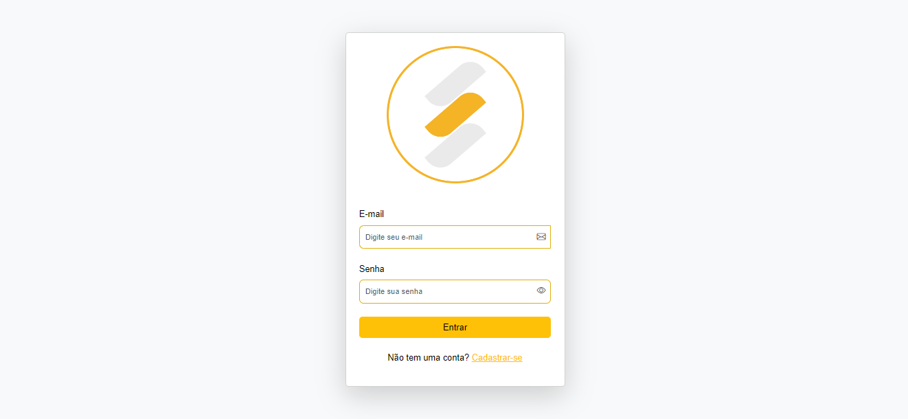
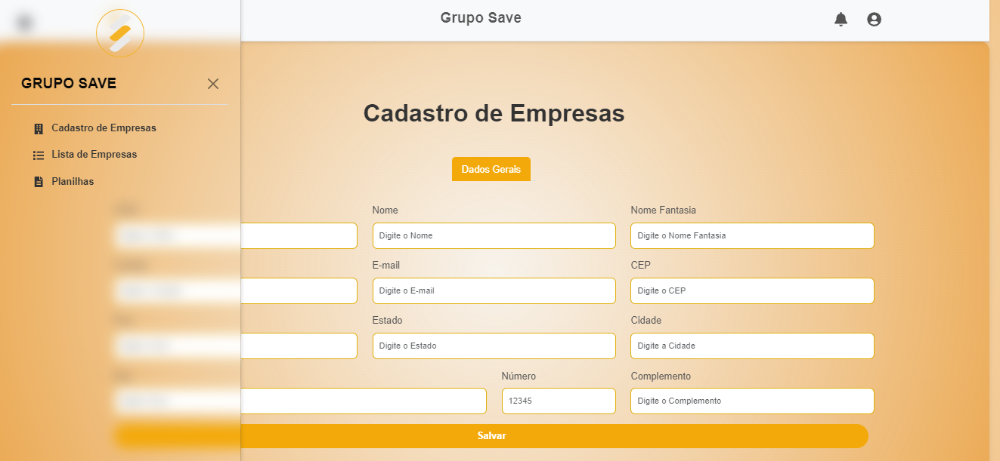
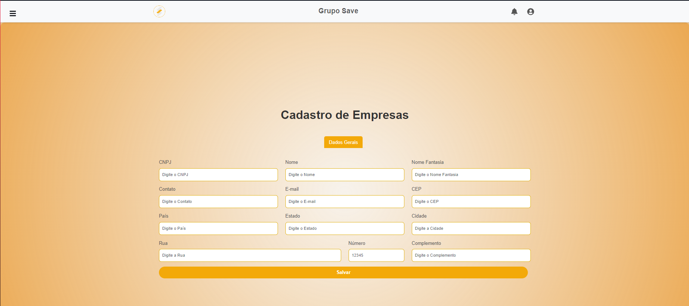
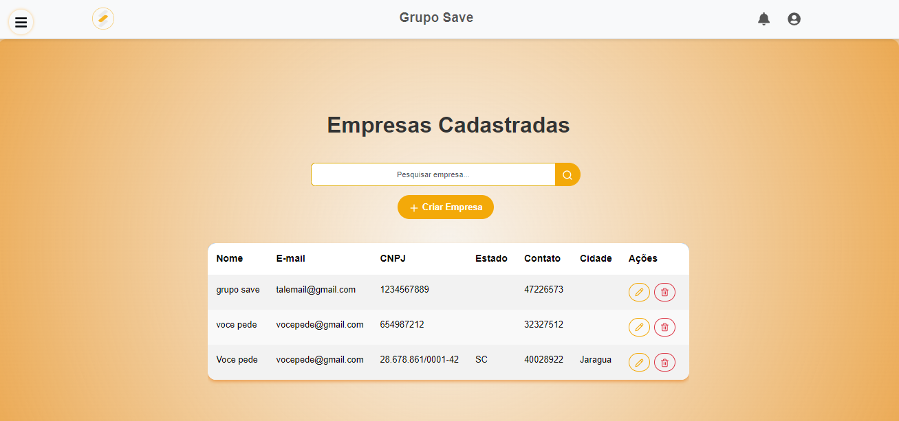
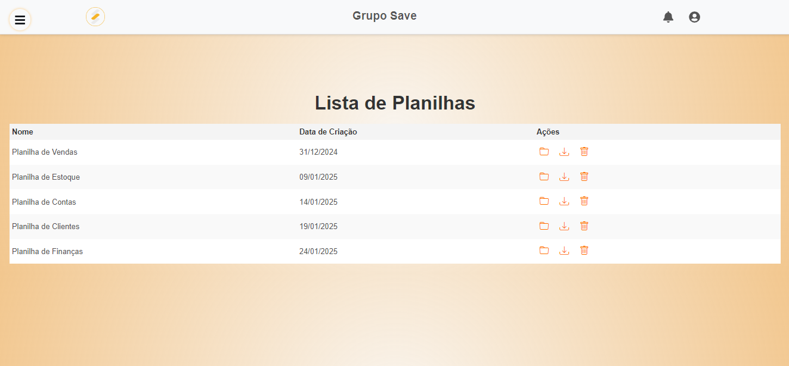

# Grupo Save

Este foi meu primeiro contato com react, projeto consiste em um sistema de cadastro e gerenciamento de empresas utilizando React, Bootstrap e uma API fake com JSON Server.

## Tecnologias Utilizadas
- **React + Vite**: Biblioteca para construção da interface do usuário
- **React Router Dom**: Gerenciamento de rotas
- **Bootstrap & React-Bootstrap**: Estilização responsiva
- **Lucide-react**: Conjunto de ícones modernos
- **JSON Server**: Backend fake para testes de API
- **CNPJ**: Validador de CNPJ

## Requisitos
- Node.js
- npm ou yarn

## Como Configurar o Projeto

1. Clone este repositório:
   ```bash
   git clone <https://github.com/WeslleyMattos/grupo-save.git>
   ```

2. Navegue até o diretório do projeto:
   ```bash
   cd grupo-save
   ```

3. Instale as dependências:
   ```bash
   npm install
   ```

## Rodando o Projeto

### 1. Inicialize o JSON Server
Abra um terminal e execute:
```bash
npx json-server --watch db.json --port 3001
```
O servidor será iniciado na porta **3001**.

### 2. Execute a aplicação React
Em um segundo terminal, execute:
```bash
npm run dev
```

### 3. Simule um login
Insira algum endereço de e-mail e senha, o projeto vai simular uma requisição na api por 2 segundos.

## Funcionalidades
- **Cadastro de Empresas:**
  - Formulário para inserção de dados de empresas
  - Validação de CNPJ com biblioteca `@fnando/cnpj`
- **Listagem de Empresas:**
  - Busca por nome
  - Ações para edição e remoção (incompleto)
- **Persistência de Dados:**
  - Os dados são armazenados no arquivo `db.json`.

## Estrutura de Pastas
```
src/
├── components/
├── pages/
├── App.jsx
└── main.jsx
```
### Login


### Menu lateral


### Cadastro de empresas


### Lista de empresas


### Lista de planilhas

